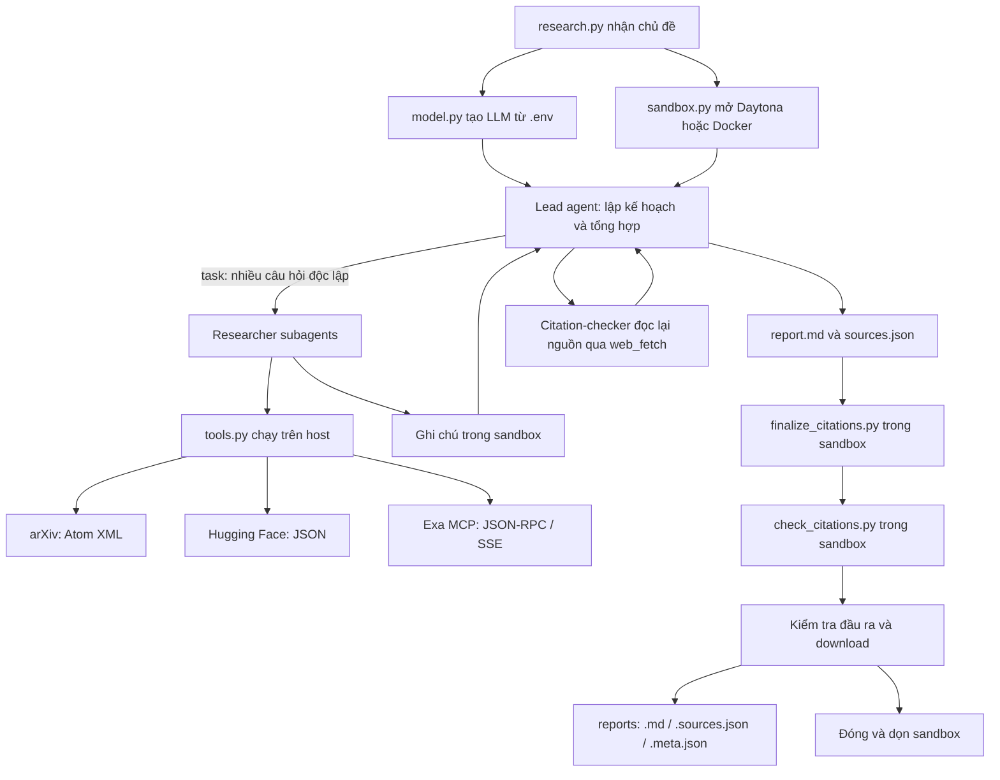

# Kiến trúc và kỹ thuật của lab

Hệ thống nhận một chủ đề, tìm bằng chứng qua nhiều researcher, viết một survey tiếng Anh rồi kiểm tra trích dẫn trước khi xuất báo cáo. Không huấn luyện mô hình; LLM có sẵn được sử dụng thông qua API hỗ trợ tool calling.



## 1. Các thành phần

| File | Trách nhiệm |
|---|---|
| tools.py | Năm tool truy xuất dữ liệu, chuẩn hóa kết quả, retry và che khóa trong lỗi |
| agents.py | Prompt của lead/researcher/checker, cấu hình tool và giới hạn từng agent |
| research.py | CLI, mở sandbox, upload script, gọi agent, kiểm tra và xuất ba artifact |
| check_citations.py | Kiểm tra tất định sự nhất quán giữa thân báo cáo, References và sources.json |
| model.py (có sẵn) | Chọn nhà cung cấp/model từ cấu hình môi trường |
| sandbox.py (có sẵn) | Backend Daytona/Docker, thao tác file, execute và dọn tài nguyên |
| finalize_citations.py (có sẵn) | Gộp URL trùng, loại nguồn không trích dẫn, đánh số và sinh References |
| tests/test_lab.py | Kiểm thử offline bằng unittest và mock |

## 2. Kỹ thuật được sử dụng

**Tool calling:** `@tool` chuyển hàm Python thành công cụ có tên, mô tả và schema tham số để LLM gọi. Model chọn thao tác; Python thực thi và trả dữ liệu. Tool chạy ở host, không gửi khóa API vào sandbox.

**Điều phối nhiều agent:** Lead dùng `write_todos` để lập kế hoạch, sau đó gọi `task` cho ít nhất ba câu hỏi. Prompt yêu cầu phát nhiều task trong cùng lượt để framework có thể chạy song song. Mức độ tuân thủ phụ thuộc model, cần quan sát trace khi kiểm tra song song. Các researcher dùng cùng cấu hình vai trò nhưng có hội thoại riêng; thông điệp giao việc phải mang đủ chủ đề, câu hỏi và đường dẫn file. Mỗi researcher ghi một file riêng, tránh ghi đè nhau.

**Tra cứu theo bằng chứng:** Tìm bài từ arXiv, HF và web, lưu nội dung hỗ trợ vào ghi chú, rồi tổng hợp theo chủ đề. Không có embedding/vector database trong bản này. Những claim chỉ xuất hiện trong trí nhớ model bị cấm trong prompt.

**Retry có giới hạn:** HTTP 429/500/502/503/504 và lỗi transport chuyển thành RetryableError. `with_retry` chờ theo Retry-After hoặc exponential backoff có jitter, chặn bởi cap. Lỗi lập trình/HTTP 400/401 không được retry. Lần cuối không ngủ. Một lock dùng chung bảo đảm các researcher cách nhau ít nhất ba giây khi gọi arXiv, kể cả retry.

**JSON-RPC và SSE:** Exa MCP được gọi bằng HTTP POST với method tools/call. Trả lời JSON hoặc event-stream được giải mã thành nội dung text. Throttling ở HTTP 200 qua metadata hoặc thông báo lỗi cũng được retry. web_fetch cắt tối đa 12000 ký tự.

**Giảm sai trích dẫn bằng mã tất định:** Lead viết thân báo cáo. Finalizer tự sinh References; validator kiểm tra nguồn rỗng, số/URL trùng, nguồn không được trích dẫn, số không tồn tại, thiếu/trùng dòng References và URL không khớp. Validator hiểu [1, 2]/[1-3], bỏ qua inline code, fenced code và link Markdown. Nó kiểm tra cấu trúc; citation-checker kiểm tra ý nghĩa của một mẫu claim qua nội dung nguồn. Kiểm tra mẫu không bảo đảm mọi câu trong báo cáo đều đúng.

**Sandbox và bí mật:** File ghi chú, báo cáo và script kiểm tra nằm trong sandbox. Tool mạng, LLM và khóa ở host. Nội dung nguồn được coi là dữ liệu không đáng tin. Backend được cung cấp chặn mạng trong sandbox; khối `with open_sandbox()` dọn tài nguyên khi thành công hoặc lỗi.

**Giới hạn chi phí:** Lead tối đa 150 model calls và 300 tool calls; tổng số task tối đa 12. Mỗi researcher tối đa 40/60; checker 15/20. Graph lead có recursion_limit=1000. Đây là trần số lượt gọi, không phải trần tiền hoặc token; token trong meta chỉ gồm tin nhắn lead.

**Xuất kết quả có kiểm tra:** Chương trình chính chạy lại validator trong sandbox và từ chối xuất nếu thiếu file, JSON hỏng, citation lỗi, sai nhãn nguồn hoặc thiếu >=3 task / >=3 họ nguồn. Báo cáo và sources được giữ nguyên bytes tải về. Artifact được ghi vào thư mục tạm trước, thay từng file và rollback khi có lỗi ghi; không phải giao dịch nguyên tử giữa cả ba file nếu tiến trình bị kill giữa lúc thay file.

## 3. Cách chạy trên Windows

Dùng interpreter của `.venv` (Python 3.11); Python mặc định trên PATH có thể là phiên bản khác.

```powershell
.\.venv\Scripts\python.exe -m pip check
.\.venv\Scripts\python.exe -m unittest discover -s tests -v
.\.venv\Scripts\python.exe tools.py
.\.venv\Scripts\python.exe research.py "survey about world model"
.\.venv\Scripts\python.exe self_check.py
```

Nếu cần cấu hình trên máy mới: tạo venv Python 3.11, cài requirements, sao chép `.env.example` thành `.env`, rồi điền model hỗ trợ tool calling và khóa nhà cung cấp, Daytona (hoặc SANDBOX=docker), Exa. Không ghi đè `.env` đang có. Không commit khóa.

Chạy năm chủ đề theo tuần tự:

```powershell
$topics = Get-Content topics.md | Where-Object { $_ -match '^\d+\. ' } | ForEach-Object { $_ -replace '^\d+\. ', '' }
foreach ($topic in $topics) {
    & .\.venv\Scripts\python.exe research.py $topic
    if ($LASTEXITCODE -ne 0) { throw "Research failed: $topic" }
}
& .\.venv\Scripts\python.exe self_check.py
```

## 4. Đọc đầu ra

- `<slug>.md`: survey tiếng Anh gồm TL;DR, Background, 3-6 theme, Trends and open problems, References.
- `<slug>.sources.json`: mỗi nguồn có n, id, url, title, date, source.
- `<slug>.meta.json`: chủ đề, model, thời gian, số task/tool, token lead, số nguồn, các họ nguồn.

Rubric tính ít nhất ba nhãn trong arxiv/hf-daily/hf-search/web; HF daily và HF search là hai nhãn rubric dù cùng một nền tảng. `source` là tool phát hiện tài liệu, không suy ra từ tên miền. Sau finalizer phải kiểm tra lại vì nguồn không dùng sẽ bị loại.

Báo cáo phải do agent sinh; khi đầu ra sai thì sửa code/prompt và chạy lại. `self_check.py` cần đủ năm bộ artifact; test offline đạt không đồng nghĩa đã hoàn tất phần nộp bài.

## 5. Kết quả kiểm chứng thực tế

Lượt chạy thử `survey about world model` đã hoàn thành với cấu hình trong `.env`: 976.5 giây (~16.3 phút), 44 nguồn, đủ bốn nhãn nguồn và 12 task calls. Validator báo `OK: 44 sources, all citations resolve`; sandbox thử nghiệm đã được dọn. Cả 23 unit test đạt, `pip check` không phát hiện dependency hỏng.

Metadata ghi 2,032,798 input tokens và 43,808 output tokens của lead; đây là tổng usage qua nhiều lượt, chưa gồm subagent, và không quy đổi trực tiếp thành tiền (nhà cung cấp có thể có cache/pricing riêng). Prompt đã được bổ sung yêu cầu ghi chú ngắn cho các lượt sau để giảm lượng nội dung đọc lại; không bảo đảm model luôn tuân thủ đúng độ dài. Sau đó đã hoàn tất cả năm chủ đề. Kết quả kiểm tra cuối: 5/5 topic và git/secrets OK; 27 unit test đạt. Xem LAB_REPORT.md và SUBMISSION_REVIEW.md để đọc kết quả toàn bộ bài nộp.
