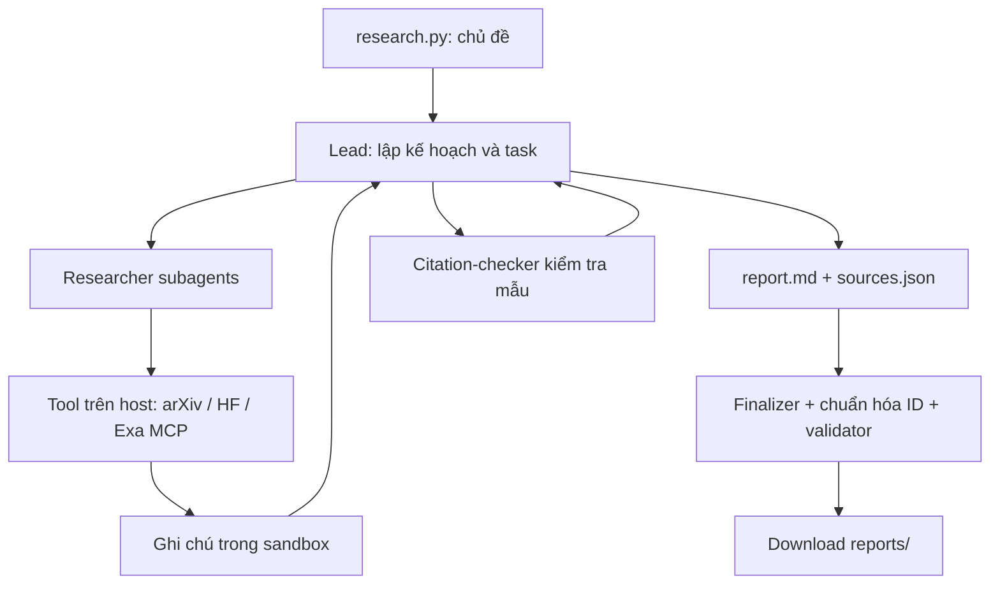

# Deep Research Agent — Advanced Deep Agents Lab

Hệ thống nghiên cứu tự động bằng Python: nhận chủ đề, giao việc cho researcher, lấy tài liệu từ arXiv/Hugging Face/web, tổng hợp survey tiếng Anh và kiểm tra trích dẫn trong sandbox trước khi xuất kết quả.

**Bài cá nhân:** Phạm Hoàng Trọng — 2A202602765.

## Kết quả nộp bài

Đã sinh đủ **5 báo cáo, 15 artifact**, tổng **141 mục nguồn** (tính theo từng báo cáo, có thể trùng giữa các chủ đề). Mỗi báo cáo có cả 4 nhãn nguồn và ít nhất 3 lần gọi `task`. `self_check.py` đạt cho cả 5 chủ đề; 27 unit test đạt.

| Chủ đề | Báo cáo | Nguồn | Task calls | Thời gian (phút) |
|---|---|---:|---:|---:|
| World models | [Survey](reports/survey-about-world-model.md) | 44 | 12 | 16.3 |
| RL for LLM reasoning | [Survey](reports/survey-about-reinforcement-learning-for-llm-reasoning.md) | 26 | 7 | 30.8 |
| LLM agents and tool use | [Survey](reports/survey-about-llm-agents-and-tool-use.md) | 21 | 6 | 8.0 |
| Video and multimodal generation | [Survey](reports/survey-about-video-and-multimodal-generation.md) | 25 | 7 | 56.9 |
| Efficient inference and small LMs | [Survey](reports/survey-about-efficient-inference-and-small-language-models.md) | 25 | 8 | 14.0 |

- [LAB_REPORT.md](LAB_REPORT.md): tổng kết triển khai, kết quả thực nghiệm, đối chiếu rubric và reflection kỹ thuật bổ sung.
- [SUBMISSION_REVIEW.md](SUBMISSION_REVIEW.md): kiểm tra trước khi nộp và 25 nguồn mẫu.
- [SUBMISSION_MANIFEST.json](SUBMISSION_MANIFEST.json): SHA-256 của 15 artifact để đối chiếu tính toàn vẹn.
- [ARCHITECTURE.md](ARCHITECTURE.md): giải thích kiến trúc, kỹ thuật và giới hạn.
- [RUBRIC.md](RUBRIC.md), [GUIDE.md](GUIDE.md), [REPORT_TEMPLATE.md](REPORT_TEMPLATE.md): yêu cầu của đề bài.

## Kiến trúc



Tool mạng và khóa API ở host; sandbox chỉ lưu file và chạy mã. Nội dung nguồn được coi là dữ liệu không đáng tin. Lead tổng hợp theo chủ đề, rồi mã Python tạo References và kiểm tra trích dẫn. Sandbox được dọn khi thoát khối `with`, kể cả khi lỗi.

## Cài đặt

Python 3.11+; môi trường kiểm chứng của bài là Python 3.11.9. Cài dependencies trong venv riêng của repo.

Windows PowerShell:

```powershell
py -3.11 -m venv .venv
.\.venv\Scripts\python.exe -m pip install -r requirements.txt
Copy-Item .env.example .env
```

Linux/macOS:

```bash
python3 -m venv .venv
.venv/bin/python -m pip install -r requirements.txt
cp .env.example .env
```

Chỉ sao chép `.env.example` khi chưa có `.env`; giữ cấu hình hiện có nếu đã cài. Điền:

- LLM hỗ trợ tool calling: `LAB_MODEL` và khóa provider; hoặc `LAB_BASE_URL`, `LAB_MODEL`, `LAB_API_KEY` cho endpoint tương thích OpenAI.
- `DAYTONA_API_KEY` để dùng Daytona. Hoặc `SANDBOX=docker` khi có Docker đang chạy; image phải có Python và bash.
- `EXA_API_KEY` để tìm/đọc web qua Exa MCP.

Các lần chạy đã nộp dùng `deepseek/deepseek-flash`; endpoint và khóa không đưa vào repo. `.env`, `.venv` đã được gitignore. Không cần các khóa để đọc báo cáo hay chạy unit test/self-check.

## Chạy

```powershell
.\.venv\Scripts\python.exe research.py "survey about world model"
```

CLI in `[tool] <tên>` để theo dõi thao tác, rồi in đường dẫn báo cáo khi thành công. Lỗi trả exit code 1; thiếu chủ đề trả 2. Không thêm số thứ tự chủ đề vào cuối lệnh.

Chạy cả 5 chủ đề (có chi phí LLM/API, chỉ cần khi muốn tái tạo):

```powershell
$topics = Get-Content topics.md | Where-Object { $_ -match '^\d+\. ' } | ForEach-Object { $_ -replace '^\d+\. ', '' }
foreach ($topic in $topics) {
    & .\.venv\Scripts\python.exe research.py $topic
    if ($LASTEXITCODE -ne 0) { throw "Research failed: $topic" }
}
```

## Kiểm tra

```powershell
.\.venv\Scripts\python.exe -m pip check
.\.venv\Scripts\python.exe -m unittest discover -s tests -v
.\.venv\Scripts\python.exe self_check.py
.\.venv\Scripts\python.exe check_citations.py reports\survey-about-world-model.md reports\survey-about-world-model.sources.json
```

Ba lệnh kiểm tra cuối không gọi LLM. `python tools.py` gọi 5 nguồn thật nếu muốn kiểm tra kết nối. Với Linux/macOS, dùng `.venv/bin/python` và đường dẫn `/` tương ứng.

## Đọc reports/

Mỗi chủ đề có ba file cùng tên gốc:

- `.md`: survey tiếng Anh; TL;DR, Background, 3–6 themes, Trends and open problems, References.
- `.sources.json`: danh sách `{n, id, url, title, date, source}`. `source` là công cụ phát hiện tài liệu, không phải tên miền của URL.
- `.meta.json`: chủ đề, model, thời gian, số task/tool, số nguồn, họ nguồn và token của lead.

`hf-daily` và `hf-search` là hai nhãn theo rubric dù cùng nền tảng HF. `subagent_calls` đếm tất cả task của lead, gồm researcher và citation-checker. Token metadata chưa gồm subagent; không dùng số đó làm tổng chi phí tiền.

## File triển khai và giới hạn

`tools.py`, `agents.py`, `research.py`, `check_citations.py` là phần cài đặt. `model.py`, `sandbox.py`, `self_check.py`, `finalize_citations.py` giữ nguyên bản đề.

Lead bị giới hạn 150 model calls / 300 tool calls / 12 task calls; researcher 40/60, checker 15/20; recursion_limit của lead là 1000. Đây là giới hạn lượt gọi, không phải giới hạn token hoặc thời gian. Lần chạy dài nhất trong bộ nộp mất khoảng 57 phút.

Validator kiểm tra cấu trúc và ID–URL; kiểm tra mẫu không chứng minh mọi câu đều đúng. Không sửa tay báo cáo đã tải về. Chuẩn hóa ID tương đương và tái tạo References chạy trong sandbox bằng `check_citations.py --normalize`, trước khi xuất. ID trỏ sang bài khác vẫn bị từ chối. Các artifact nộp giữ nguyên bytes hiện có; `.gitattributes` ngăn git đổi line endings của chúng.
